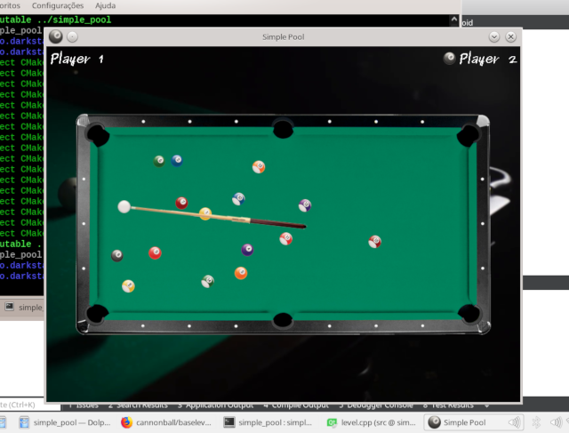

# Simple Pool
WORK IN PROGRESS  

Using phoemur/simple_pool as a base, the goal of this project is to create a pool-playing agent that uses auto-differentiation as a local search tecnique.

# Requirements
See the devcontainer
  
# Build and Run
While inside the devcontainer:  
```
mkdir -p build
cd build
cmake ..
make
```

From outside the devcontainer:
```
./simple_pool
```


# Using the agent
As of right now, only a proof-of-concept functionality is provided. In game, the "E" key can be pressed to make the agent attempt to shoot the cueball to the position (400,200).
